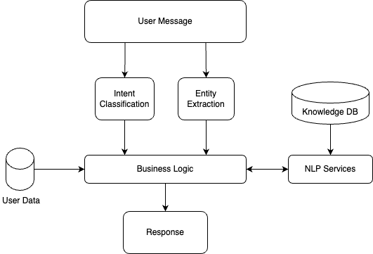
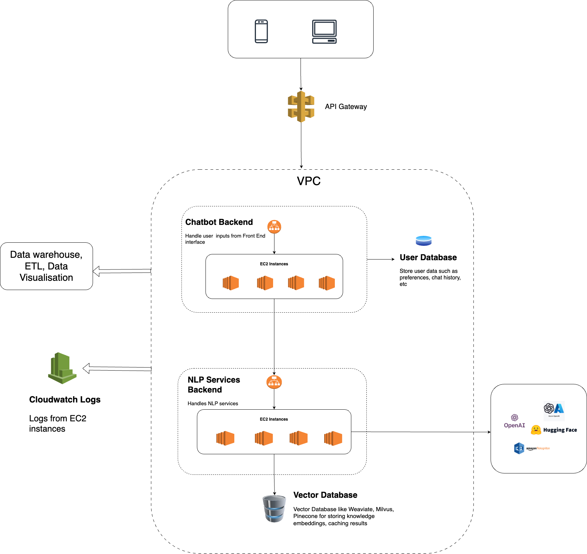
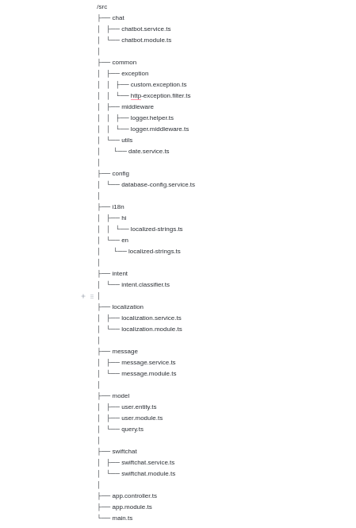

Bot Development Basics
======================

Chatbot Overview
----------------
Chatbots can be Rule-Based or Conversational. Rule-based chatbots are those that interact with the user in a deterministic way, such as with the help of buttons, form elements, widgets, etc. Whereas conversational bots take user input in natural language, which bot then understands and generates responses with the help of NLP/AI techniques.
A typical chatbot solution comprises the following components:

- **Chat Interface:** From where the end users can interact. There are plenty of popular interfaces available such as WhatsApp, Telegram, Line, etc. Swiftchat is one of them but it's novel for hosting bots.
- **Chatbot Backend:** Responsible for handling user inputs received from the Chat interface and responding accordingly.
- **NLP Services:** Utlised for user's intent classification and response generation. It processes user queries using natural language processing techniques when the user communicates in natural language. 
- **Database:** Stores user data, manages knowledge, and maintains chat history and logs

Chatbot Flow
~~~~~~~~~~~~~~~~~~~~~~~
A typical Conversational AI bot flow looks like as follows:

When a user types a text into the Chat interface, it goes to the Chatbot Backend where it extracts the Intent and Entities from the text with the help of NLP services.
Based on extracted intent, the appropriate business logic will be executed. E.g. in a typical customer service bot, a user may ask "Can you provide me the status of my loan application ID 12345". In this example, the user intent is "Get Application Status", entity is "Application ID: 12345". Hence business logic related to retrieving application status will get executed. Once retrieved, the NLP service again is required to generate response in natural language.

Architecture
~~~~~~~~~~~~~~~~~~~~~~~
A typical Chatbot architecture can be visualized on AWS as follows:

Chatbot Backend
^^^^^^^^^^^^^^^^^
The Chatbot Backend serves as the core application responsible for managing user interactions on the Swiftchat Platform. Its key responsibilities include:

- Implementing logic for various use cases
- Utilizing Swiftchat APIs to engage with users
- Leveraging NLP Backend services for natural language query processing
- Managing user preferences and chat history

This backend suffices for Rule-Based bots where natural language processing is unnecessary.

NLP Backend Services
^^^^^^^^^^^^^^^^^^^^^
This module handles natural language queries using generative AI technologies such as `OpenAI <https://openai.com/>`_ or `open-source LLMs <https://huggingface.co/models>`_. Its typical services include:

- Ingesting and managing knowledge within the Vector database
- Generating responses to queries posed in natural language using LLM services like `OpenAI <https://openai.com/>`_.
- Caching results to optimize LLM service costs

Database
^^^^^^^^^^^^^^^^^
The database is used to store bot knowledge data, user data, chat history, analytics, etc. Hence for different use cases, different types of databases are utilised. For e.g. to store user data SQL/NOSQL databases such as MySQL or MongoDB can be used. To store bot knowledge data, a vector database is the ideal choice as it stores data in a format that is understandable by Machine Learning Models. In conversational bots, we utilize Vector databases such as ChromaDB, Weaviate, Milvus, Pinecone, etc. to store text embeddings (Vectors) of all textual/multi-media data as Knowledge store, which then will be queried by bot logic for different use cases.

For building a Conversational Chatbot we typically build the knowledge store by generating text embeddings and indexing Documents such as PDFs, text files, and strings, serving as knowledge for bot responses. Furthermore, vector db is also used as a cache to store LLM-generated responses in order to optimize latency and LLM usage cost.

Logging, Health Check, Data Analytics
^^^^^^^^^^^^^^^^^^^^^^^^^^^^^^^^^^^^^^
It is also necessary to keep monitoring the chatbot performance in real-time for various aspects such as the quality of bot response for each user query, overall system performance and to analyze user behavior.
AWS CloudWatch facilitates monitoring infrastructure health, including server logs and resource utilization.

An Alarm service can be set up to receive alerts for unexpected issues. Key metrics to monitor include:

- EC2 Instances Utilization
- Request Counts

Chatbot Starter Kit 🚀
-----------------------

The Chatbot Starter Kit is a carefully designed collection of resources that forms the foundation for creating impressive chatbot applications On `SwiftChat platform <https://convegenius.com/>`_. It includes essential tools, templates, and best practices, making it an excellent starting point for your chatbot development journey.

Here, we present our Chatbot Starter Kit, a resource designed to help developers build strong chatbot applications. Whether you're new to chatbot development or an experienced developer looking for an effective solution, this guide is your key to mastering our starter kit.

To initiate the setup of the Chatbot Starter Kit, adhere to these steps:

1. **Prerequisites:** Prior to proceeding, ensure that the following software components are installed on your system:
  
   - `Node.js <https://nodejs.org/en>`_ and `Node Package Manager <https://docs.npmjs.com/getting-started>`_
   -  Nest.js CLI : ``npm install -g @nestjs/cli``
   - `Git <https://git-scm.com/downloads>`_

2. **Fork the Repository:** It is advisable to fork the base repository, facilitating seamless integration of the latest upgrades and features when necessary.
  
   - Navigate to the Chatbot Starter Kit repository on GitHub: `Chatbot Starter Kit Repository <https://github.com/madgicaltechdom/chatbot-nestjs-boilerplate>`_
   - Click the "Fork" button located in the upper right corner of the repository page, and optionally rename the repository according to your preference. A recommended naming convention is **`<application name>-swift-chatbot`**. This action will generate a duplicate of the repository under your GitHub account.

    .. image:: ../images/create_bot_images/fork_image.png
      :alt: Create Fork Image
      :width: 4000
      :height: 400
      :align: center

3. **Clone the Repository:**
   
   - Access your terminal or command prompt.
   - Execute the subsequent command to clone the forked Chatbot Starter Kit repository: 
    ``git clone <Forked Repository Code>``

    .. image:: ../images/create_bot_images/clone-id.png
      :alt: Forked Repository Code
      :width: 3000
      :height: 350
      :align: center

   - Following the cloning process, proceed to install dependencies by running following commands: 
  
        1.  ``cd chatbot-nestjs-boilerplate``
        2.  ``npm install``

Upon completing these steps, you'll be fully prepared to commence your work with the Chatbot Starter Kit.

Starter Kit Structure
-----------------------

Let's take a look at the organization of our Chatbot Starter Kit repository, which has been meticulously structured to enhance usability and navigation.

At present, the starter kit comprises two primary folders and one file, which are outlined below:

- **/src:** Within this directory lies the core source code of the chatbot application. This is where you'll primarily focus your efforts, developing and tailoring the logic of your chatbot.

- **/tests:** Housed here are the test cases and testing utilities crucial for validating the reliability and functionality of your chatbot. Emphasizing the writing of tests is essential for upholding code quality standards.

- **/.env:** The `.env` file serves as a pivotal configuration file, housing environment variables vital for your chatbot application. It's utilized for defining sensitive data such as API keys, database credentials, and other configuration values that shouldn't be hardcoded in your source files. Ensuring the secure handling of this file and refraining from sharing sensitive information publicly is paramount.

Overview of src folder
~~~~~~~~~~~~~~~~~~~~~~~~~~~~
The **src** folder is further organized into multiple subfolders and files. Please refer to the attached image below for a visual representation.

- **/chat**

  - **chatbot.service.ts:** Manages chatbot-related functionalities such as processing user input and generating responses.
  - **chatbot.module.ts:** Defines the module for the chatbot service, organizing related components, directives, and services.

- **/common**

  - **exception**

    - **custom.exception.ts:** Contains custom exceptions for specific scenarios.
    - **http-exception.filter.ts:** Handles HTTP exceptions, providing appropriate error messages or redirects.
  
  - **middleware**

    - **logger.helper.ts:** Helper functions for logging.
    - **logger.middleware.ts:** Middleware for logging requests and responses.
  
  - **utils**

    - **date.service.ts:** Utility functions for working with dates.

- **/config**

  - **database-config.service.ts:** Configures database connections and settings.

- **/i18n**

  - **hi**
    - **localized-strings.ts:** Localization strings for Hindi.

  - **en**
    - **localized-strings.ts:** Localization strings for English.

- **/intent**

  - **intent.classifier.ts:** Logic for classifying user intents.

- **/localization**

  - **localization.service.ts:** Handles localization logic.
  - **localization.module.ts:** Module for localization-related services.

- **/message**

  - **message.service.ts:** Manages chatbot messages.
  - **message.module.ts:** Module for message-related services.

- **/model**

  - **user.entity.ts:** Entity definition for user data.
  - **user.module.ts:** Module for user-related functionality.
  - **query.ts:** Logic for executing database queries.

- **/swiftchat**

  - **swiftchat.service.ts:** Service for SwiftChat-related functionality.
  - **swiftchat.module.ts:** Module for SwiftChat-related services.

- **app.controller.ts:** Handles application-level routes.
- **app.module.ts:** Main module of the application, importing various modules and components.
- **main.ts:** Entry point of the application, initializing and starting the server.

