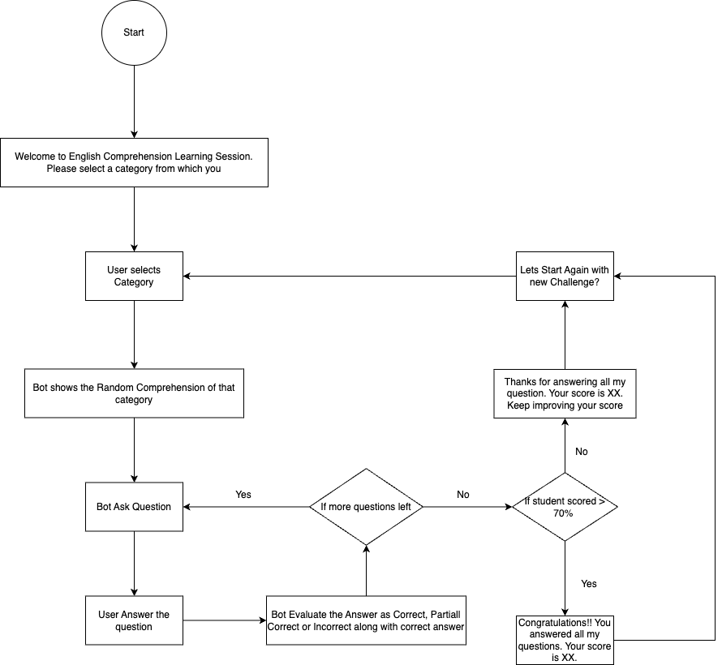

Bot Development Blueprint
=========================
Take your bot development skills to the next level with advanced techniques and best practices tailored to meet your specific requirements. From inception to deployment, here's what you need to consider.

Choose Your Bot
----------------

When starting your bot development journey, the first step is to decide what type of bot you want to create. Do you envision a friendly customer service assistant, a knowledgeable e-commerce helper, or perhaps an entertaining trivia companion? Understanding the purpose of your bot is crucial as it sets the direction for the entire development process. By defining your bot's role early on, you can focus on crafting a tailored experience that meets the needs and expectations of your target audience.

Analyze Your Target Audience
------------------------------

To create a successful bot, you must understand who will be interacting with it – your target audience. Conduct thorough research to learn about their preferences, habits, and pain points. What are their interests? What challenges do they face? By gaining insights into your audience's demographics and behaviors, you can tailor your bot's features and content to resonate with them effectively. This understanding enables you to provide personalized and relevant interactions, fostering stronger engagement and satisfaction among users.

Create Workflow of Bot
-----------------------

Once you've defined your bot's purpose and identified your target audience, it's time to map out its conversational flow. Designing a clear and intuitive workflow is essential for ensuring smooth interactions between users and your bot. Start by outlining the various paths users can take and defining the responses and actions your bot will provide at each step. Consider different scenarios and edge cases to create a robust framework that can handle diverse user inputs. By visualizing and refining your bot's workflow, you can create a seamless and enjoyable experience for users, guiding them towards their goals effectively.

Take a look at the below example flow:--
   

