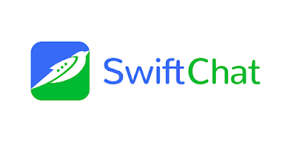

Welcome to the SwiftChat documentation! This guide will walk you through the process of getting started with SwiftChat, creating chatbots, building advanced chatbots, and deploying your bots in production environments.

Getting Started with SwiftChat
---------------------------------
In this section, we'll guide you through the initial steps to begin using SwiftChat. We'll cover:

1. **Signing Up and Logging In**: Get started by signing up for a SwiftChat account and logging in.
2. **Creating a Merchant Account**: Learn how to create a merchant account to access SwiftChat's features and services.
3. **Authentication API**: Explore how to use SwiftChat's authentication API to ensure secure access to your account.
4. **Creating Your First Bot**: Follow a simple tutorial to create a "Hello World" bot and get familiar with the bot creation process.

Building Advanced Chatbots
------------------------------
Now that you're comfortable with the basics, let's dive into building advanced chatbots on SwiftChat. In this section, we'll cover:

1. **Preparation Steps**: Before creating your chatbot, we'll discuss essential preparatory steps such as creating an idea, analyzing your target audience, and creating a workflow for your bot.
2. **Updating Your Starter Kit**: Learn how to update SwiftChat's starter kit according to your bot's workflow, ensuring a seamless development process.
3. **Reducing OpenAI Costs**: Discover strategies for minimizing OpenAI costs while maintaining the efficiency and effectiveness of your chatbot.
4. **Understanding Vector Databases**: Gain insights into the concept of vector databases and how they can enhance the performance of your chatbot.
5. **Analytics Reporting**: Explore the importance of analytics reporting in tracking the performance of your chatbot and making data-driven improvements.

Deploying Your Bot in Production
------------------------------------
Congratulations on creating your chatbot! Now it's time to deploy it to a production environment where it can start engaging with users. In this section, we'll discuss best practices for deploying your bot and ensuring its scalability and reliability.

Template: Bot Flow and Features
--------------------------------
In this section, we'll introduce you to various bot flows and their features that you can incorporate into your SwiftChat chatbots. Let's explore:

1. **Celebrity Bot**: Discover how to implement a celebrity bot that provides information and updates about popular personalities.
2. **News Bot**: Learn how to create a news bot that delivers the latest news updates on various topics of interest.
3. **Religious Bot**: Explore the features of a religious bot, which can provide users with spiritual guidance, prayers, and information about religious events.

By incorporating these bot flows and features into your chatbots, you can enhance their functionality

.. only:: not index 
   
   .. toctree::
      :maxdepth: 1
      :hidden:

      introduction.rst

   .. toctree::
      :maxdepth: 1
      :caption: Get Started
      :hidden:
      
      start_with_swiftchat.rst
      bot_development_basic.rst
      hello_world.rst
   
   .. toctree::
      :caption: Advanced Bot Development
      :hidden:
      
      bot_development_blueprint
      advance_bot.rst
      media_support.rst
      cost_optimization.rst
      vector_database.rst
      analytics.rst
   
   .. toctree::
      :caption: Best Practices
      :hidden:
      
      best_practices.rst
   
   .. toctree::
      :caption: Bot Deployement
      :hidden:

      deploy.rst
      version_control.rst
   
   .. toctree::
      :caption: api reference
      :hidden:

      api_reference.rst
      
   
  .. toctree::
      :caption: Template
      :hidden:

      template_api.rst

  .. toctree::
      :caption: resources
      :hidden:

      resources.rst

  .. toctree::
      :caption: FAQs
      :hidden:

      api.rst

  .. toctree::
      :caption: Conclusion
      :hidden:

      conclusion.rst     