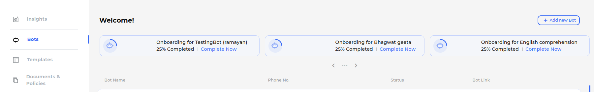
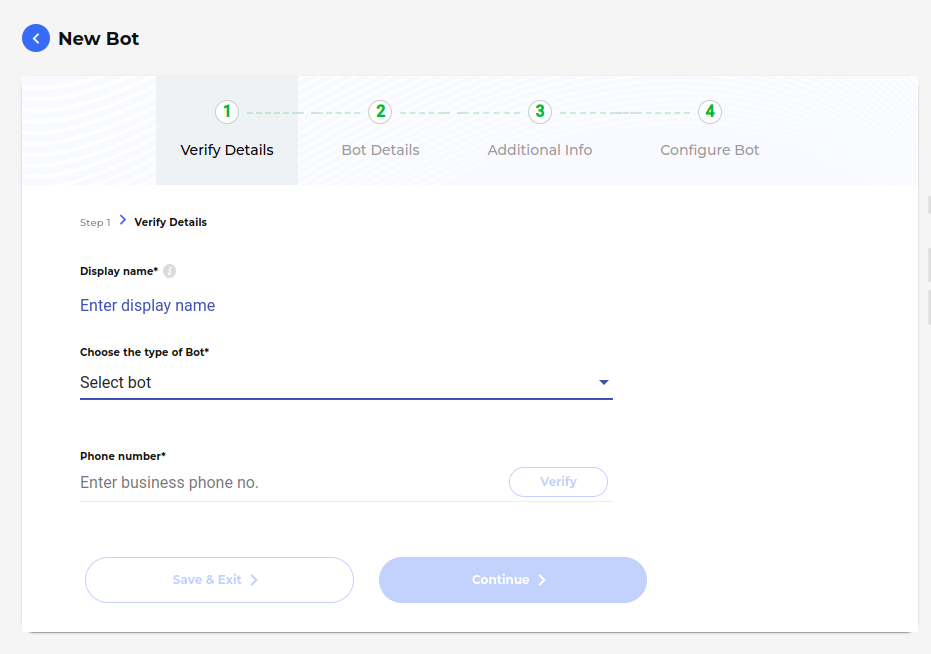

Get started with swiftchat
==========================

Registration on Swiftchat Merchant Account
------------

Registration on SwiftChat is a simple process that allows users to create an account and access the platform's features. For registration follow these steps:

1. Open swiftchat `dashboard <https://dashboard.swiftchat.ai/register>`_.
2. Upon accessing the website, you will encounter a page prompting you to input essential details, including your name, phone number, and password. Enter you details and continue with "Register now" option.
   
   .. image:: ../images/installation_images/registration.png
      :alt: login page 
      :width: 2000
      :height: 350
      :align: center
      
3. Upon entering your details, you will receive an email for email verification. At this point, verify your email to proceed with the login steps.

   .. image:: ../images/installation_images/login.png
      :alt: login page 
      :width: 2000
      :height: 350
      :align: center

4. Following the login process, you may be prompted to complete the business KYC procedure.

5. Upon successful KYC and login, you will gain access to the SwiftChat merchant dashboard. From here, you can create bots and obtain API keys as needed.

Following these steps will complete the registration process.

Obtain API key
------------
API keys are essential for authentication and accessing various features of the SwiftChat platform. They serve as a means of verifying your identity and ensuring secure communication between your application and the SwiftChat servers. Each API request you make to the SwiftChat platform must include your API key as part of the authentication process.

To obtain your API key and unlock access to the SwiftChat platform's features, you need to have a merchant account. Once you have registered and logged in to your merchant account, you can generate your API key.

.. tip:: 

   - Create your merchant account using this Post `API <https://documenter.getpostman.com/view/20587790/UyrGCuhH#57d73550-1c15-41a5-ac7e-0ba20b60b3e4>`_ 
   - Complete business KYC and email verification

**Follow these steps to get API key:**

- Open the `SwiftChat Merchant Dashboard <https://dashboard.swiftchat.ai/>`_
- Login to dashboard with your merchant credentials
- Click on profile settings tab and open **Manage Account**
  
   .. image:: ../images/installation_images/profile_settings.png
      :alt: login page 
      :width: 4000
      :height: 350
      :align: left

- In **Manage Account** page you will get the API key at the bottom of page. You can copy the API key from there or create a new one.
  
   .. image:: ../images/installation_images/apiKey_page.png
      :alt: login page 
      :width: 4000
      :height: 450
      :align: left

.. tip::
   You can also get the API key using the **GET** `API <https://documenter.getpostman.com/view/20587790/UyrGCuhH#3ed63aad-3f81-4f42-b0a0-8406feb59716>`_

Setting Up a New Bot
-----------------------------------
To begin utilizing the starter kit, you'll need to obtain a bot ID. You can create a chatbot either manually or via API.

Creating a Bot Using the SwiftChat API
~~~~~~~~~~~~~~~~~~~~~~~~~~~~~~~~~~~~~~~~~

The SwiftChat APIs act as the conduit between your chatbot and yourself, processing your data accordingly. 

You can employ any tool or platform to interact with the SwiftChat APIs. In this instance, we'll demonstrate using curl.

**Steps**

1. Open your terminal or command prompt. If you don't have curl installed, you can install it using npm by running the ``npm install -g curl`` command in your terminal
2. Create a new **POST** request using curl
3. Use the following API endpoint:``https://v1-api.swiftchat.ai/api/bots`` 
4. Include your API key in the header that you obtained during `Obtaining API Key <get_api_key.html>`_ 
5. In the body, include details such as bot-name, mobile-number, and bot-category
6. Add the header and the body to your curl request::
 
      curl --location 'https://v1-api.swiftchat.ai/api/bots' \
       --header "Content-Type: application/json" \
       --header "Authorization: Bearer YOUR_API_KEY_HERE" \
       --data '{
           "mobile": "+91XXXXXXXXXX",
           "configuration": {
           "name": "Test"
           "category":"Education"
          }
      }'

7. On successfully creating bot you will receive a message indicating **created**.

8. After creating bot, use the `**varify API** <https://documenter.getpostman.com/view/20587790/UyrGCuhH#a5fa0876-d1b1-48de-a475-dad2ff467071>`_  to generate the bot ID.

Creating a Bot Using the SwiftChat Dashboard
~~~~~~~~~~~~~~~~~~~~~~~~~~~~~~~~~~~~~~~~~~~~
You can also create bot using your SwiftChat Merchant Dashboard

**Steps:**

1. Login to your `SwiftChat Merchant Dashboard <https://dashboard.swiftchat.ai/bots>`_.
   

.. tip:: 

   - Create your merchant account using this Post `API <https://documenter.getpostman.com/view/20587790/UyrGCuhH#57d73550-1c15-41a5-ac7e-0ba20b60b3e4>`_ 
   - Complete business KYC and email varification

2. Click on **Add New Bot** button.

3. Clicking **Add New Bot** button will redirect you to a page where you can input the bot details, including the phone number, bot name, and bot type.Enter these details and proceed for verification. Once verification is completed, the bot will be created and activated.

4. Copy the bot link and save it for future reference. The link should resemble this format: 

   .. code-block:: html

      https://cgweb.page.link/?link=https%3A%2F%2Fweb.convegenius.ai%3FbotId%3D0216260609726241&apn=ai.convegenius.app. 

   - In the link, the bot ID is structured as **botId%3D0216260609726241**, where the actual ID follows the "3D" prefix. So here the ID is **0216260609726241**.

